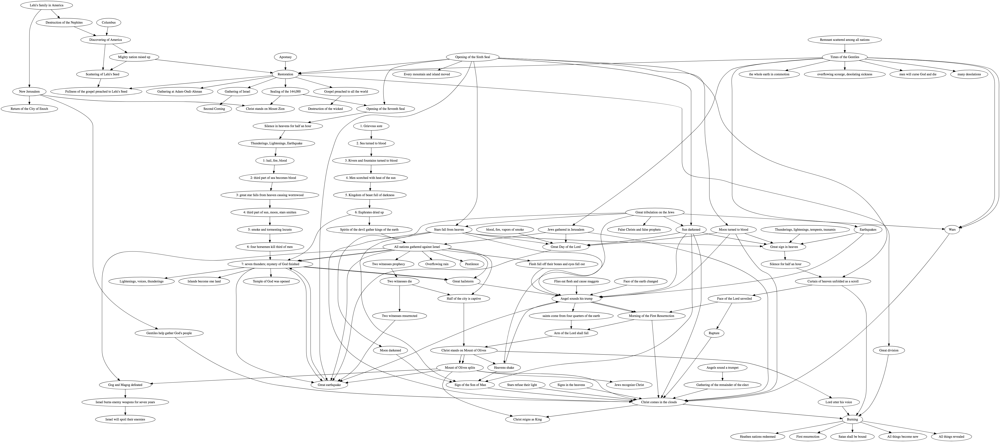

# Signs of the Second Coming

Exploring the order of the signs of the Second Coming of Christ as mentioned in scripture.
I use [DOT](https://en.wikipedia.org/wiki/DOT_(graph_description_language)) to describe 
relationships between signs and then visualize it with either an [online](https://dreampuf.github.io/GraphvizOnline/) 
tool or a local [VS Code plugin](https://marketplace.visualstudio.com/items?itemName=joaompinto.vscode-graphviz).

I have a list of [questions](questions.md) regarding my current analysis.

Here's a recent image of the chart I have so far.

