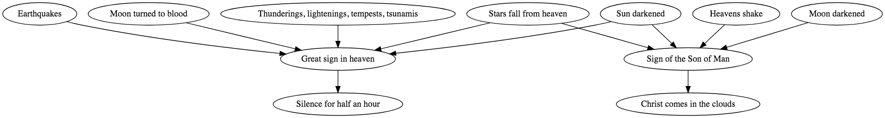

## "Moon turned to blood" and "Moon darkened"

The two different phrases seem very different initiatlly. "Turned to blood" implies the moon turned red in color while "darkened" seems to imply it was totally darkened like a new moon or ecplise. But perhaps they're the same. The moon turns red during lunar eclipses when sunlight is reflected off of the earth; that's much darker than direct sunlight.

### Moon turned to blood

- **Joel 2:31** - moon into blood
  - The sun shall be turned into darkness, and the *moon into blood*, before the great and the terrible day of the Lord come.
- **Acts 2:20** - moon into blood
  - Quoting Joel: The sun shall be turned into darkness, and the *moon into blood*, before that great and notable day of the Lord come.
- **Revelation 6:12** - moon became as blood
  - And I beheld when he had opened the sixth seal, and, lo, there was a great earthquake; and the sun became black as sackcloth of hair, and the *moon became as blood*; And the stars of heaven fell unto the earth
- **D&C 29:14** - moon shall be turned into blood
  - But, behold, I say unto you that before this great day shall come the sun shall be darkened, and the *moon shall be turned into blood*, and the stars shall fall from heaven, and there shall be greater signs in heaven above and in the earth beneath;
- **D&C 34:9** - moon be turned into blood
  - But before that great day shall come, the sun shall be darkened, and the *moon be turned into blood*; and the stars shall refuse their shining, and some shall fall, and great destructions await the wicked.
- **D&C 45:42** - moon turned into blood
  - And before the day of the Lord shall come, the sun shall be darkened, and the *moon be turned into blood*, and the stars fall from heaven.
- **D&C 88:87** - moon shall be bathed in blood
  - For not many days hence and the earth shall tremble and reel to and fro as a drunken man; and the sun shall hide his face, and shall refuse to give light; and the *moon shall be bathed in blood*; and the stars shall become exceedingly angry, and shall cast themselves down as a fig that falleth from off a fig tree.

### Moon darkened

- **Joel 3:15** - moon shall be darkened
  - The sun and the *moon shall be darkened*, and the stars shall withdraw their shining.
- **Matthew 24:29-30 (JST Matthew 1)** - moon shall not give her light
  - Immediately after the tribulation of those days shall the sun be darkened, and the *moon shall not give her light*, and the stars shall fall from heaven, and the powers of the heavens shall be shaken: And then shall appear the sign of the Son of man in heaven: and then shall all the tribes of the earth mourn, and they shall see the Son of man coming in the clouds of heaven with power and great glory.
- **Mark 13:24** - moon shall not give her light
  - But in those days, after that tribulation, the sun shall be darkened, and the *moon shall not give her light*, And the stars of heaven shall fall, and the powers that are in heaven shall be shaken. And then shall they see the Son of man coming in the clouds with great power and glory.
- **Revelation 8:12** - third part of the moon ... was darkened
  - And the fourth angel sounded, and the third part of the sun was smitten, and the *third part of the moon*, and the third part of the stars; so as the third part of them was darkened, and the day shone not for a third part of it, and the night likewise.
- **2 Nephi 23:10 (Isaiah 13:10)** - moon shall not cause her light to shine
  - For the stars of heaven and the constellations thereof shall not give their light; the sun shall be darkened in his going forth, and the *moon shall not cause her light to shine*.

## "Christ comes in the clouds," "Great sign in heaven," and "Sign of the Son of Man"

| Sign | Before | After |
----- | ---- | ----
| Christ comes in the clouds | Mount of Olives splits; Gentiles help gather God's people; Jews gathered in Jerusalem; Morning of the First Resurrection; Rapture; Sign of the Son of Man; Gathering of the remainder of the elect; Sun darkened; Moon turned to blood; Stars refuse their light; Stars fall from heaven; Signs in Heavens; Wars | Burning; Christ reigns as king |
| Great sign in heaven | Stars fall from heaven; sun darkened; Moon turned to blood; Thunderings, lightenings, tempests, tsunamis; Earthquakes | Silence for half an hour; Curtain of heaven unfolded as a scroll |
| Sign of the Son of Man | Moon darkened; Stars fall from heaven; Heavens shake; Sun darkened | Christ comes in the clouds |

I'm pretty sure that "Great sign in heaven" and "Sign of the Son of Man" are the same. However I'm not sure that "Christ comes in the clouds" is the same. It seems that a sign may be given before he actually appears. My main reason for believing this is that JST Matthew 1:36 seems to imply that Christ comes in the clouds _after_ the sign is given.

The "sign of the son of man" is only referred to in Matthew 24 (and JST Matthew 1).
The "great sign in heaven" is referred to in Revelation 12:1 and D&C 88.

JST Revelation 12:1 refers to the "great sign in heaven" as being "a woman clothed with the sun, and the moon under her feet, and upon her head a crown of twelve stars." But it also says that the sign was "in the likeness of things on the earth." John is describing his vision which is symbolic and not necessarily literal. Also, he's talking about the apostasy and war in heaven, not the second coming. So I don't believe this is the same sign as the one being described in D&C 88 which clearly is related to the second coming.

Therefore, we're left with the "sign of the son of man" in Matthew 24 (JST Matthew 1) and the "great sign in heaven" in D&C 88.

# Possibilities

* "Heavens shake" and "Stars fall from heaven"